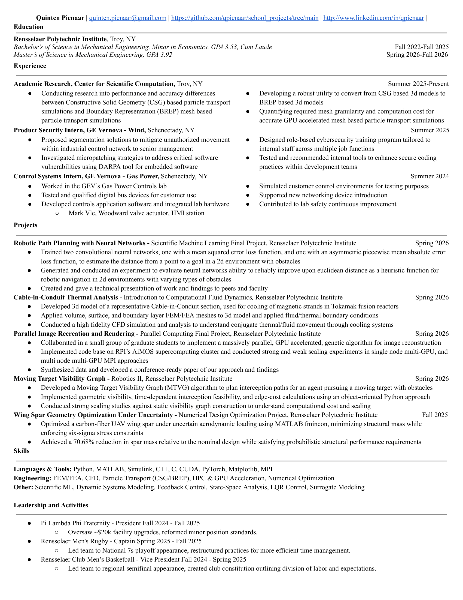

# School Engineering Projects

This repository is a compilation of repersentative projects from my time studying Mechanical Engineering at RPI. It is intended for potential recruiters or collaborators to familiarize themselves with my past projects and skills. For questions or comments, please reach out to me at my email below.

quinten.pienaar@gmail.com

## Repository Organization

| Field | Content |
| --- | --- |
| [Computational Engineering](computational_engineering/) | CFD, scientific machine learning, parallel computing, numerical design optimization, and MS research. |
| [Controls and Robotics](controls_and_robotics/) | Mechatronics, modeling and control of dynamical systems, and robotics. |

## Resume

[View the full-resolution resume](Summer26Resume-1.png)

## Featured Projects

| Project | Area | Summary |
| --- | --- | --- |
| [Cable-in-Conduit Thermal Analysis](computational_engineering/Introduction_to_Computational_Fluid_Dynamics/Cable_in_Conduit_Thermal_Analysis/) | Computational fluid dynamics | Thermal CFD analysis of a superconducting-magnet cooling passage for fusion-reactor applications. |
| [Deep Learning Path Planning](computational_engineering/Scientific_Machine_Learning/Deep_Learning_Path_Planning/) | Scientific machine learning | CNN-derived heuristics for reducing A* search effort on obstacle maps. |
| [MS Research](computational_engineering/MS_research/) | Graduate research | Comparison of CSG and BREP mesh-based particle transport simulation pipelines. |
| [Parallel Image Recreation and Rendering](computational_engineering/Parallel_Computing/mona_lisa/) | Parallel computing | Multi-GPU and MPI genetic-algorithm rendering of a target image with transparent triangles. |
| [Wing Spar Optimization Under Uncertainty](computational_engineering/Numerical_Design_Optimization/wing_spar_uncertain/) | Design optimization | Finite element structural optimization using stochastic loading and six-sigma stress constraints. |
| [Moving Target Visibility Graph](controls_and_robotics/Robotics_II/final_project/) | Robotics | Dynamic path-planning data structure for interception of a moving target among polygonal obstacles. |
| [Self-Balancing Segway Control](controls_and_robotics/Mechatronics/segway/) | Mechatronics | Nonlinear modeling, linearization, and LQR control of an inverted-pendulum robot. |

## Technical Areas

- Numerical simulation: finite element beam models, CFD, nonlinear ODE models, and surrogate modeling.
- Algorithms: A* search, visibility graphs, genetic algorithms, constrained optimization, and uncertainty quantification.
- Computing: MATLAB, Python, PyTorch, C, CUDA, MPI, Simulink, Slurm, and HPC experimentation.
- Control and robotics: system identification, transfer functions, LQR design, magnetic levitation, and moving-target planning.

## Documentation Notes

Each field, course, and project directory contains its own README. Reports and presentations included in project folders provide the formal derivations and results; the READMEs provide a concise index and reproduction guidance. 
